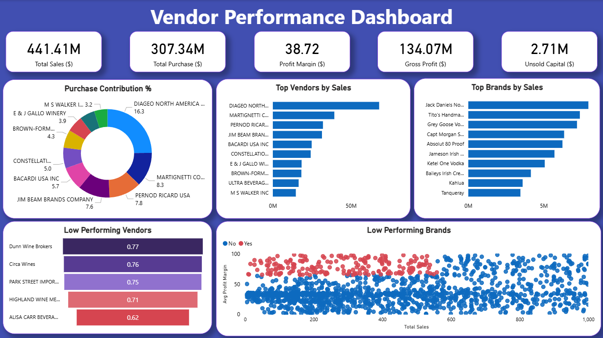

# 🧾 Vendor Performance Analysis – Retail Inventory & Sales

_🚀 A comprehensive analysis of vendor efficiency, profitability, and inventory performance to support **data-driven purchasing and pricing decisions** in the retail industry._

---

## 📘 Project Overview

_This project focuses on identifying **high-performing vendors**, analyzing **profit margins**, and optimizing **inventory turnover**._

A full analytics pipeline was designed using:
- 🧮 **SQL** for ETL and data ingestion  
- 🐍 **Python** for data cleaning, statistical testing, and EDA  
- 📊 **Power BI** for building an interactive performance dashboard 

---

## 🎯 Business Problem
Effective inventory and sales management are critical in the retail sector. This project aims to:
- Identify underperforming brands needing pricing or promotional adjustments
- Determine vendor contributions to sales and profits
- Analyze the cost-benefit of bulk purchasing
- Investigate inventory turnover inefficiencies
- Statistically validate differences in vendor profitability

---

## 📂 Dataset Summary  
- **Data Source:** Multiple CSV files (vendors, purchases, sales, and inventory)  
- **Storage:** SQLite database for relational querying  
- **Data Volume:** ~20,000+ rows across multiple tables  
- **Purpose:** To generate vendor-level summary insights used in EDA and visualization 

---

## 🧰 Tools & Technologies  
| Category | Tools Used |
|-----------|-------------|
| **Database** | SQL (CTEs, Joins, Filtering) |
| **Data Analysis** | Python (Pandas, Matplotlib, Seaborn, SciPy) |
| **Visualization** | Power BI (KPIs, Interactive Dashboard) |
| **Version Control** | Git & GitHub |

---

## 🏗 Project Structure

```

vendor-performance-analysis/
│
├── README.md
├── Vendor Performance Report.pdf
│
├── cleaned data/               # cleaned data for EDA extracted from raw data
│   └── clean_data_for_analysis.csv
│
├── notebooks/                  # Jupyter notebooks
│   ├── exploratory_data_analysis.ipynb
│   └── vendor_performance_analysis.ipynb
│
├── scripts/                    # Python scripts for ingestion and processing
│   ├── ingestion_db.py
│   └── get_vendor_summary.py
│
└── dashboard/                  # Power BI dashboard file
    └── vendor_performance_dashboard.pbix

```

---

## 🧹 Data Cleaning & Preparation
- Removed transactions with:
    - Gross Profit ≤ 0
    - Profit Margin ≤ 0
    - Sales Quantity = 0
- Created summary tables with vendor-level metrics
- Converted data types, handled outliers, merged lookup tables

---

## 📊 Exploratory Data Analysis (EDA)

**Negative or Zero Values Detected:**
- Gross Profit: Min -52,002.78 (loss-making sales)
- Profit Margin: Min -∞ (sales at zero or below cost)
- Unsold Inventory: Indicating slow-moving stock

**Outliers Identified:**
- High Freight Costs (up to 257K)
- Large Purchase/Actual Prices

**Correlation Analysis:**
- Weak between Purchase Price & Profit
- Strong between Purchase Qty & Sales Qty (0.999)
- Negative between Profit Margin & Sales Price (-0.179)

---

## 📈 Research Questions & Key Findings
1. **Brands for Promotions:** 198 brands with low sales but high profit margins
2. **Top Vendors:** Top 10 vendors = 65.69% of purchases → risk of over-reliance
3. **Bulk Purchasing Impact:** 72% cost savings per unit in large orders
4. **Inventory Turnover:** $2.71M worth of unsold inventory
5. **Vendor Profitability:**
    - High Vendors: Mean Margin = 31.17%
    - Low Vendors: Mean Margin = 41.55%
6. **Hypothesis Testing:** Statistically significant difference in profit margins → distinct vendor strategies

---

## 📊 Dashboard

- Power BI Dashboard shows:
    - Vendor-wise Sales and Margins
    - Inventory Turnover
    - Bulk Purchase Savings
    - Performance Heatmaps
    - Vendor Performance Dashboard



---

## ✅ Final Recommendations
- Diversify vendor base to reduce risk
- Optimize bulk order strategies
- Reprice slow-moving, high-margin brands
- Clear unsold inventory strategically
- Improve marketing for underperforming vendors

---

## 👤 Author & Contact
**Anmol Virdi**  
📧 Email: [anmolvirdi.av@gmail.com](mailto:anmolvirdi.av@gmail.com)  

🔗 LinkedIn: [anmol-virdi-bb4706186](https://www.linkedin.com/in/anmol-virdi-bb4706186/)
